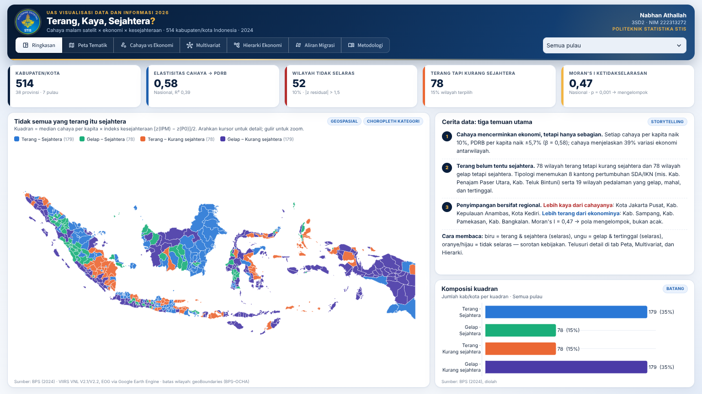

# Terang, Kaya, Sejahtera? 🛰️
**Dashboard interaktif cahaya malam, ekonomi, dan kesejahteraan 514 kabupaten/kota Indonesia (2024)**

UAS Visualisasi Data dan Informasi 2026 · Nabhan Athallah (3SD2 / 222313272) · Politeknik Statistika STIS

🔗 **Aplikasi:** `https://<nama-app>.streamlit.app` *(isi setelah deploy)*



---

## 1. Latar belakang & pertanyaan
Citra cahaya malam satelit VIIRS sering dipakai sebagai proksi aktivitas ekonomi. Namun, apakah wilayah yang **terang** juga **kaya**, dan apakah wilayah yang kaya juga **sejahtera**? Dashboard ini menjawab empat pertanyaan:

1. Seberapa kuat cahaya malam mencerminkan PDRB per kapita kabupaten/kota?
2. Wilayah mana yang terang tetapi kurang sejahtera, atau gelap tetapi sejahtera?
3. Sektor apa yang menopang ekonomi tiap pulau/provinsi?
4. Ke mana penduduk bermigrasi, dan apakah "terang" menarik migran?

## 2. Halaman dashboard (satu tab = satu fungsi, tanpa gulir di laptop)
| Tab | Topik visualisasi | Isi & interaksi |
|---|---|---|
| **Ringkasan** | Geospasial + storytelling | 5 KPI, peta kuadran cahaya × kesejahteraan, tiga temuan utama, komposisi kuadran |
| **Peta Tematik** | Geospasial | Choropleth 14 variabel (kuantil/Jenks/interval sama), simbol proporsional (PDRB/penduduk/radiance), kab/kota ↔ provinsi, klik wilayah → profil 9 indikator (peringkat nasional), 10 teratas/terbawah, interpretasi otomatis |
| **Cahaya vs Ekonomi** | Relasi (multivariat) | Scatter log-log + garis OLS nasional & per pulau, residual paling menyimpang, KPI elastisitas |
| **Multivariat** | Data berdimensi tinggi | Biplot PCA (laso/kotak) → parallel coordinates, heatmap/radar profil klaster, peta tertaut (*brushing & linking*), pencilan Mahalanobis |
| **Hierarki Ekonomi** | Hierarki | Treemap/icicle Indonesia → Pulau → Provinsi → 17 lapangan usaha → subsektor (ukuran = PDRB, warna = Location Quotient), sunburst per provinsi, *drill-down* + *breadcrumb* |
| **Aliran Migrasi** | Aliran (flow) | Sankey antarpulau/antarprovinsi, peta aliran berarah, matriks OD, filter asal & tujuan, ambang arus, model gravitasi |
| **Metodologi** | — | Sumber data (judul, tahun, URL, tanggal akses), alasan *encoding*, metode, keterbatasan, deklarasi AI, unduh CSV |

Filter pulau global (kanan atas) berlaku di 5 tab pertama; peta otomatis *zoom-to-extent*. Palet kategorikal 4 & 7 warna lolos uji simulasi buta warna; sekuensial biru satu-hue; divergen biru–abu–merah.

**Performa.** Batas wilayah disederhanakan dengan *mapshaper* (Visvalingam, 12%, presisi 0,001°) menjadi `static/kabkota.geojson` (±340 KB) dan `static/provinsi.geojson` (±110 KB), lalu disajikan sebagai berkas statis (`server.enableStaticServing`) yang di-cache peramban. Figur peta hanya memuat kode wilayah + nilai, sehingga muatan per tab turun dari ±7 MB menjadi ±100–200 KB.

## 3. Data
| Variabel | Sumber | Tahun |
|---|---|---|
| PDRB per kapita ADHB, PDRB ADHB, laju PDRB | BPS — PDRB Kabupaten/Kota di Indonesia 2020–2024 | 2024 |
| IPM | BPS — IPM menurut kabupaten/kota | 2024 |
| P0 (persentase penduduk miskin) | BPS — Data & Informasi Kemiskinan Kab/Kota 2024 | 2024 |
| Indeks Kemahalan Konstruksi | BPS — IKK Provinsi & Kab/Kota 2024 | 2024 |
| Jumlah & kepadatan penduduk | BPS | 2024 |
| PDRB 17 lapangan usaha (provinsi) | BPS — PDRB Provinsi menurut Lapangan Usaha 2021–2025 | 2024 |
| Migrasi risen antarprovinsi | BPS — Statistik Migrasi Indonesia, Long Form SP2020 (Tabel 5.3 & 7) | 2015–2020 |
| Cahaya malam (radiance) | NOAA/EOG VIIRS VNL V2.1 (2020) & V2.2 (2024) via Google Earth Engine | 2020, 2024 |
| Batas wilayah ADM2 | geoBoundaries IDN ADM2 (sumber BPS–WFP–OCHA), CC BY 3.0 IGO | 2020 |

Variabel turunan utama: `cahaya_pk` = Σ radiance ÷ penduduk × 1.000; `pct_menyala` = % piksel > 0,5 nW/cm²/sr; `pertumbuhan_cahaya` = 100·[ln(Σrad₂₀₂₄+1) − ln(Σrad₂₀₂₀+1)]; `indeks_sejahtera` = [z(IPM) − z(P0)]/2.

## 4. Metode analisis (notebook 02)
- **Regresi log-log OLS** ln(PDRB/kap) ~ ln(1 + cahaya/kap), galat baku HC3; residual terstandar |z| > 1,5 = *tidak selaras*.
- **Kuadran** median cahaya × indeks kesejahteraan.
- **Moran's I & LISA** pada residual (bobot Queen + KNN untuk pulau, 999 permutasi).
- **PCA** 9 variabel terstandar + **k-means** (k dipilih dengan silhouette).
- **Model gravitasi** migrasi: Poisson PPML.

## 5. Temuan utama
- Elastisitas cahaya → PDRB per kapita **β = 0,58** (R² = 0,39; p < 0,001): cahaya +10% ≈ PDRB/kap +5,7%. Stabil setelah mengontrol kepadatan & IKK (β = 0,61).
- **52 kab/kota tidak selaras**: 32 "lebih kaya dari cahayanya" (mis. Jakarta Pusat, Kep. Anambas, Kota Kediri) dan 20 "lebih terang dari ekonominya" (mis. Sampang, Pamekasan, Bangkalan).
- Ketidakselarasan **mengelompok secara spasial** (Moran's I = 0,47; p = 0,001).
- **78 wilayah terang tetapi kurang sejahtera** dan 78 gelap tetapi sejahtera.
- Tipologi k-means: perkotaan padat & terang (186), perdesaan berkembang (301), kantong pertumbuhan SDA/IKN (8: mis. Morowali, Halmahera Tengah, Teluk Bintuni), pedalaman tertinggal gelap & mahal (19).
- Migrasi didominasi arus Jabodetabek–Jawa; model gravitasi: jarak (−1,21) & penduduk tujuan (+0,65) signifikan, cahaya tujuan tidak signifikan.

## 6. Struktur repositori
```
├── app.py                         # titik masuk Streamlit: header, navigasi, filter global
├── dashboard/
│   ├── core.py                    # palet, format angka, utilitas grafik, pemuatan data (cache)
│   ├── style.py                   # CSS tema biru–putih, kartu, tinggi kartu mengikuti layar
│   ├── peta.py                    # pembangun peta ringan (choropleth, simbol, legenda)
│   └── t1_ringkasan.py … t7_metodologi.py   # satu berkas per tab
├── static/                        # GeoJSON tersederhanakan (disajikan statis)
├── assets/                        # logo STIS, tangkapan layar
├── notebooks/
│   ├── 01_persiapan_dan_integrasi_data.ipynb
│   └── 02_analisis_statistik.ipynb
├── data/input/  data/processed/   # data bersih & keluaran notebook
├── requirements.txt  requirements-notebook.txt
└── .streamlit/config.toml         # tema & static serving
```
Membuat ulang `static/`: `npx mapshaper data/input/kabkota_514_dashboard.geojson -filter-fields kode_bps -simplify 12% keep-shapes -o static/kabkota.geojson precision=0.001`.

## 7. Menjalankan secara lokal
```bash
pip install -r requirements.txt
streamlit run app.py
```
Menjalankan ulang notebook: `pip install -r requirements-notebook.txt`, lalu jalankan `notebooks/01…` kemudian `02…` (keluaran ditulis ke `data/processed/`).

## 8. Keterbatasan
Cahaya malam hanyalah proksi (sektor tambang/jasa padat modal kurang terlihat); analisis agregat wilayah rentan *ecological fallacy*; VIIRS 2020 (V2.1) dan 2024 (V2.2) berbeda versi; 47 kab/kota memiliki < 15 malam bebas awan; data migrasi mengacu 34 provinsi (2015–2020).

## 9. Deklarasi penggunaan AI
Asisten AI (Claude, Anthropic) digunakan sebagai alat bantu untuk ekstraksi tabel PDF, validasi data, penyusunan kode, dan peninjauan rancangan visualisasi. Seluruh keputusan analitis dan interpretasi diverifikasi oleh penulis.

## 10. Lisensi & atribusi
Data BPS © Badan Pusat Statistik. VIIRS VNL © Earth Observation Group, Payne Institute (CC BY 4.0). Batas wilayah geoBoundaries (Runfola et al., 2020), CC BY 3.0 IGO.
